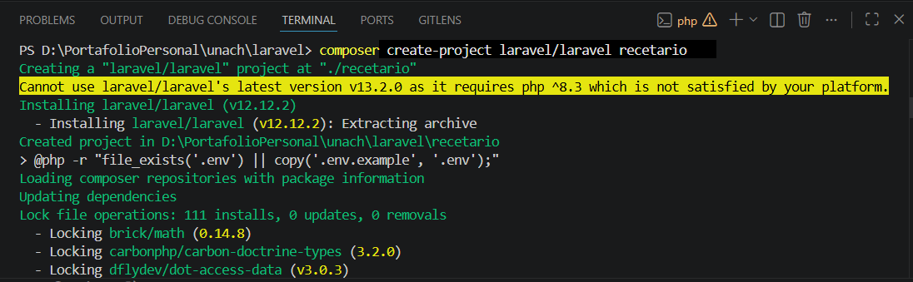
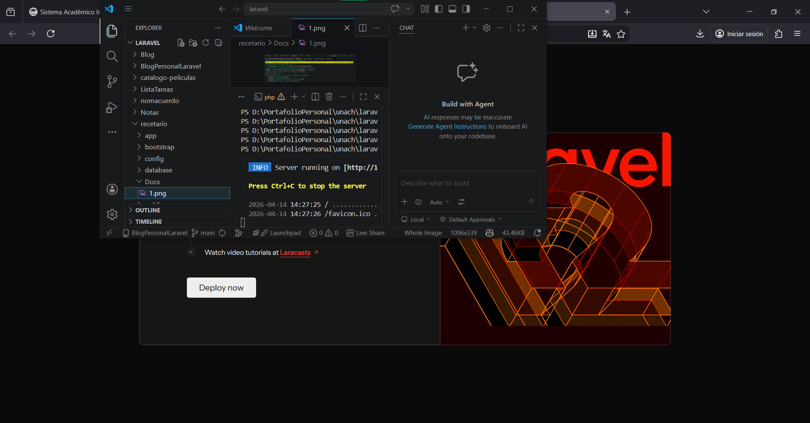
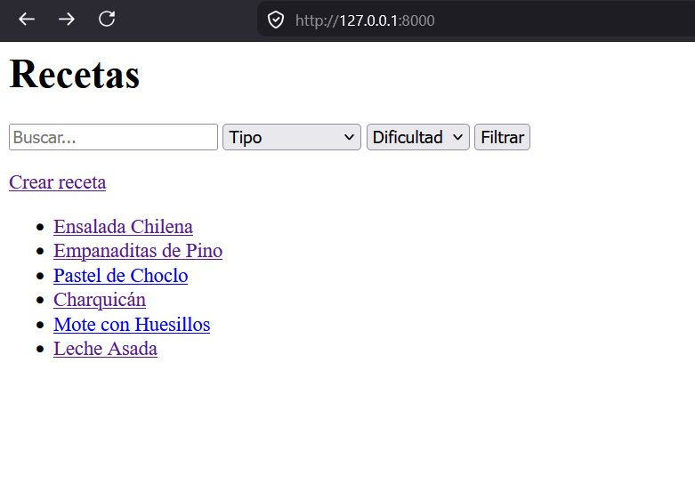
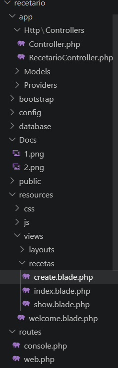

# LaravelEvaluacion1RecetarioWeb
Evaluacion 1 de la asignatura de desarrollo web con Laravel

## Funcionalidades

- Listado de recetas
- Filtro por tipo y dificultad
- Búsqueda por nombre
- Visualización de detalle
- Creación de recetas

##  Inicialización

## Servidor activo

## Primera Prueba

## Árbol de directorios

## Rutas de la aplicación

| Método | URL            | Nombre            | Controlador@Método            |
|--------|----------------|------------------|-------------------------------|
| GET    | /              | recetas.index    | RecetarioController@index     |
| GET    | /recetas/{id}  | recetas.show     | RecetarioController@show      |
| GET    | /crear         | recetas.create   | RecetarioController@create    |
| POST   | /crear         | recetas.store    | RecetarioController@store     |
| GET    | /buscar        | recetas.buscar   | RecetarioController@buscar    |